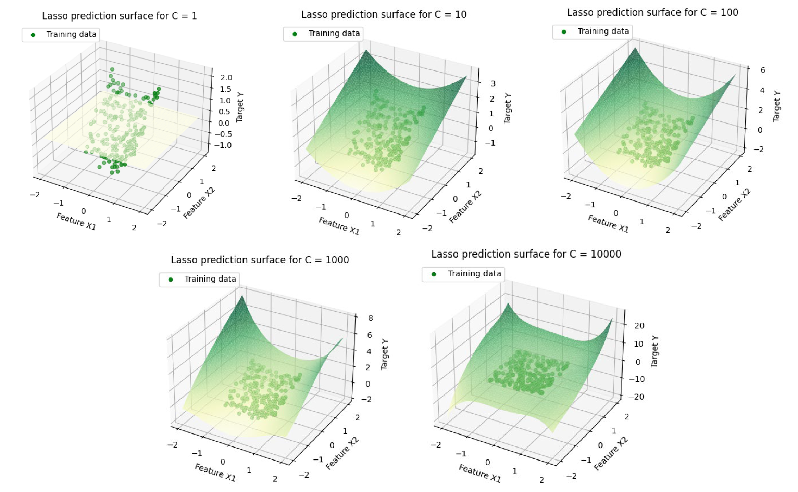

# Machine_Learning_Module
Below is a Summary of each of the important tasks and graphs relating to each assignment.

## Assignment 1

Use sklearn to train a logistic regression classifier on the data. 

Use the trained logistic regression classifier to predict the target values in the training data. Add these predictions to the 2D plot you generated in
part (i), using a different marker and colour so that the training data and the predictions can be distinguished. Show the decision boundary of the logistic regression classifier as a line on a scatter plot diagram.

Use sklearn to train linear SVM classifiers on the data. Train linear SVM classifiers for a wide range of values of the penalty parameter C e.g. C = 0.001, C = 1, C = 100. Give the SVM model for predictions and report the parameter values of each trained model. 
Use each of these trained classifiers to predict the target values in the training data. Plot these predictions and the actual target values from the data, together with the classifier decision boundary.

Create two additional features by adding the square of each feature (i.e. giving four features in total). Train a logistic regression classifier. Use the trained classifier to predict the target values in the training data. Plot these predictions and the actual target values from the data using the same style of plot.

</img>
</img>

 ---
## Assignment 2
In addition to the two features in the data file add extra polynomial features equal to all combinations of powers of the two features up to power 5.
Train Lasso regression models with these polynomial features for a large range of values of C e.g. 1, 10, 1000 (you might need to adjust these values for your data, start by making C small enough that the trained model has all parameters zero, then increase from there). Report the parameters of the trained models, discuss how they change as C is varied.
For each of the models generate predictions for the target variable.
Use 5-fold cross-validation to plot the mean and standard deviation of the prediction error vs C. Use the matplotlib errorbar function for this. You will need to choose the range of values of C to plot, justify your choice. Repeat for a Ridge Regression model.

</img>

---
## Assignment 3
Augment the two features in the dataset with polynomial features and train a Logistic Regression classifier with L2 penalty added to the cost function. Use cross-validation to select the maximum order of polynomial to use and the weight C given to the penalty in the cost function. You’ll also need to select the range of C values to consider and the range of maximum polynomial orders.

Train a kNN classifier on the data. Use cross-validation to select k, again presenting data and explanations/analysis to justify your choice.
Calculate the confusion matrices for your trained Logistic Regression and kNN classifier.

</img>
</img>
</img>

---
## Assignment 4
Using vanilla python (no use of sklearn, keras or the like) implement a function that takes as input an array and a kernel, convolves the kernel to the input array and returns the result.

Select an image. In python load the image as three RGB arrays and select one of these arrays to work with.
Use keras to build a convolutional network for classification of images in the CIFAR10 image dataset. This dataset contains 50K small 32 × 32 colour images plus labels. Explore the effect of increasing the amount of training data on the performance of the ConvNet after training. Explore the effect of increasing the amount of training data on the
performance of the ConvNet after training. Modify the ConvNet to use max-pooling i.e. replace the 16 channel strided layer with a 16 channel same layer followed by a (2,2) max-pool layer. Evaluate the performance of this ConvNet. How many parameters does keras say this ConvNet has? For 5K training data point how does the time taken to train the network and the prediction accuracy on the training and test data compare with that of the original network?

</img>

